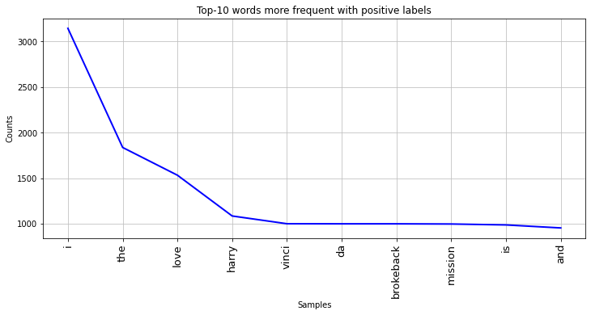
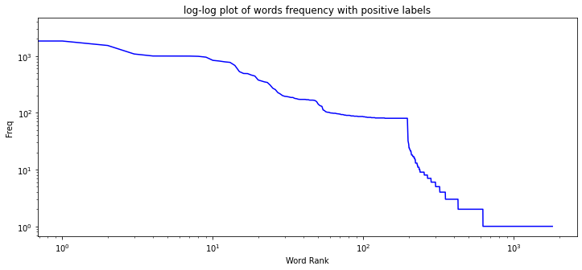
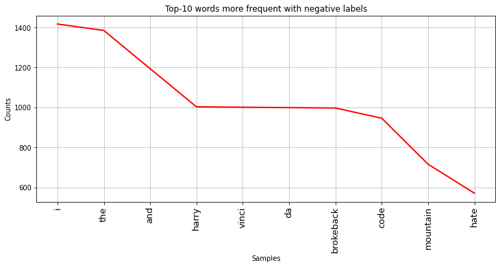
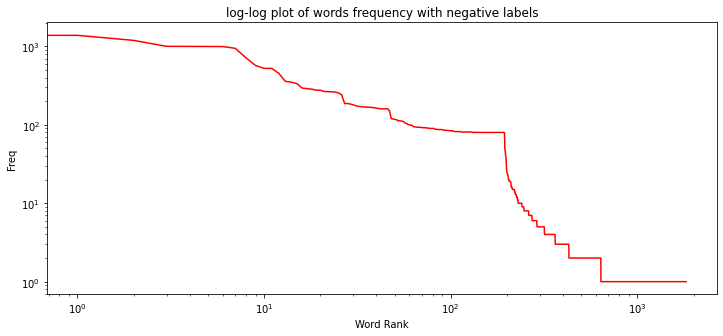
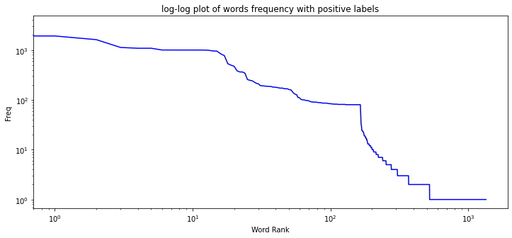
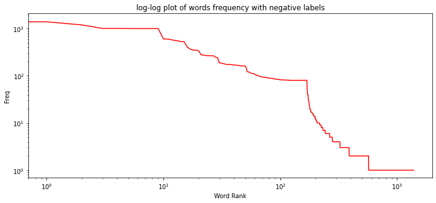
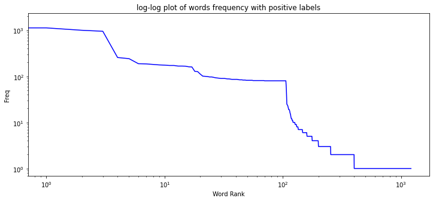
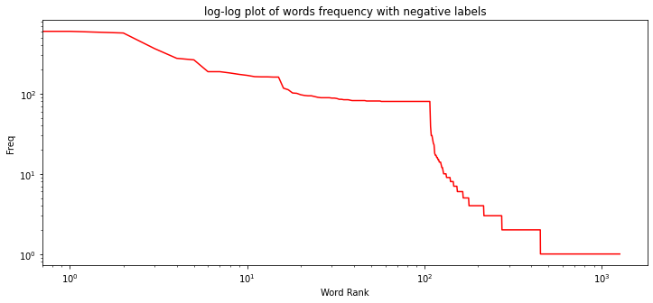

# Twitter Sentiment Analysis Training Corpus

## Table of contents
* [General Info](#general-info)
* [Introduction](#introduction)
* [Goals](#goals)
* [Technologies](#technologies)
* [Dependencies](#dependencies)
* [How To Use](#how-to-use)
* [Ideas and Discussions](#ideas-and-discussions)
* [Improvement Possibilities](#improvement-possibilities)
* [Steps](#steps)
* [Results](#results)
* [Classification Report and Confusion Matrix](#classification-report-and-confusion-matrix)

## General Info:
This project is for Python/DS Coding Task.

## Introduction:
The Twitter Sentiment Analysis Dataset contains around 36000 classified tweets of training and dataset. The trainingset itself has around 7000 tweets which each row is marked as 1 for positive sentiment and 0 for negative sentiment. I tried using this dataset with a very simple Naive Bayesian classification algorithm.

## Goals:
* Show the top-10 most positive words, top-10 negative words (words more frequent with positive and negative labels respectively).
* Plot the frequency of any word (which is inversely proportional to its rank in the frequency table) using Zipf law.
* Train using simple classifier to predict sentiment.

## Technologies:
Project is created with:
* Python 3
* Jupyter Notebook
* NLTK

## Dependencies:
see requirements.txt

## How To Use:
* Clone this repository
* Run the .ipynb file with jupyter notebook

## Ideas and Discussions
* Multinomial Naive Bayes classification algorithm tends to be a baseline solution for sentiment analysis task. The basic idea of Naive Bayes technique is to find the probabilities of classes assigned to texts by using the joint probabilities of words and classes. When we have discrete data (e.g. tweets ratings/labels 1 for positive and 0 for negative as each rating will have certain frequency to represent). In text classification we have the count of each word to predict the class or label. If the words can be represented in terms of their occurrences (frequency count) then use multinomial event model.

## Improvement Possibilities
* Use Stemming to change each words into their root word.
* Use Cross-Validation (GridSearch CV) to check if you have used a model with too much capacity (overfitting); This allows us to easily test out different hyperparameter configurations using for example the KFold strategy to split the model into random parts to find out if it’s generalizing well or if it’s overfitting.

## Steps
* Importing Libraries
* Importing and analyzing the dataset
* Data Visualization: to check the balance of word distributions
* Data Pre-Processing 1: Text Cleaning (remove html, hyperlinks, hashtags, etc.)
* Data Pre-Processing 2: Tokenization without Stop-Words
* Data Pre-Processing 3: Feature Extraction (Vectorization - Bag of Words)
* Train Test Split: Labeled dataset is splitted 70:30
* Creating Pipeline: to manage the 3 preprocessing steps above in one step
* Model Evaluation: See the [Results](#results)
* Evaluation on split testdataset
* Test on Dataset.txt (no label)

## Results
### Words more frequent with positive and negative labels using Zipf Law
#### Before cleaning the data

#### After cleaning the data

#### After cleaning the data and using stopwords

#### Classification Report and Confusion Matrix

